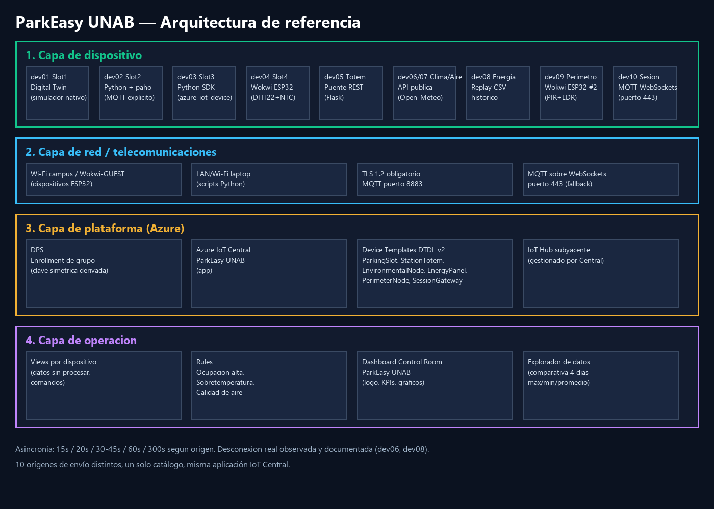
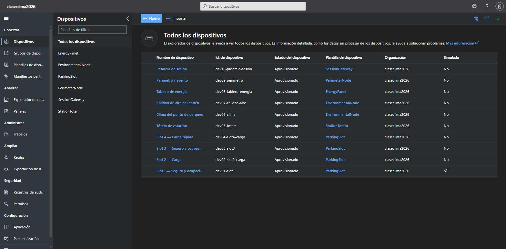
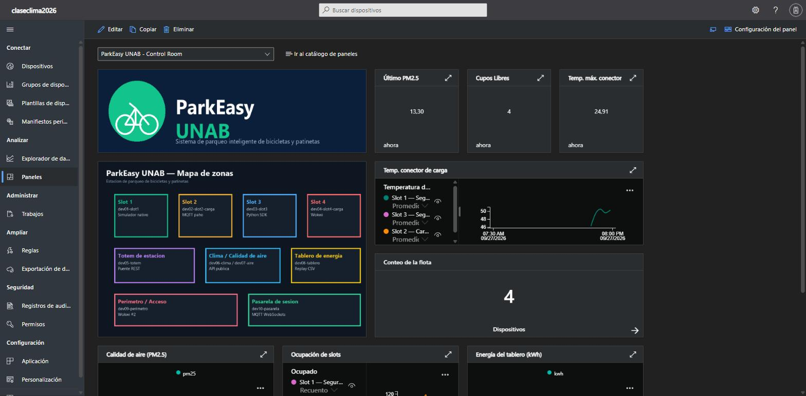
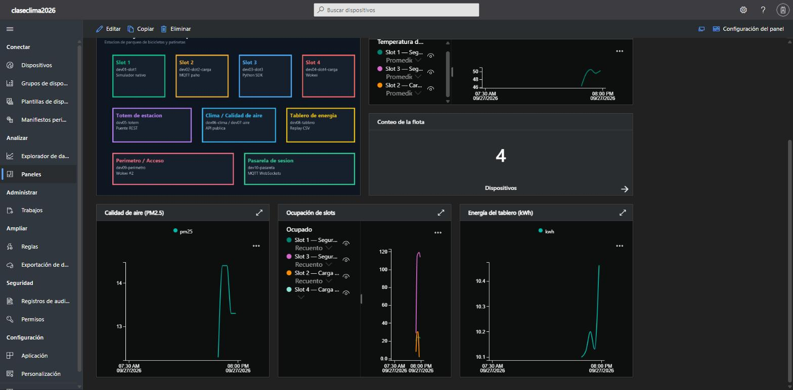
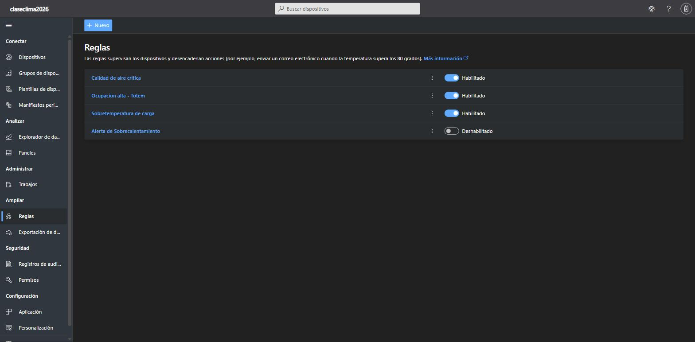

# ParkEasy UNAB — Sistema de control para el parqueadero de bicicletas y patinetas

**Universidad Autónoma de Bucaramanga · IoT + Cloud + Sistemas Distribuidos · Parcial 1 · 2026-II**

---

## 0. Portada


- Proyecto: **ParkEasy UNAB**
- Escenario: 5.5 — Parqueo de bicicletas y patinetas UNAB
- Grupo: Jaime Alejandro Vega Barbosa (U00178766), Juan Sebastián Jiménez Daza (U00177874)
- Fecha de entrega: 2026-09-27

---

## 1. Historial de versiones

| Fecha | Autor | Cambio | Versión Device Template | Versión scripts |
|---|---|---|---|---|
| 2026-09-27 | Jaime Vega, Juan Jiménez | Creación del escenario, catálogo de 10 dispositivos y DTDL v1 | ParkingSlot v1, StationTotem v1, EnvironmentalNode v1, EnergyPanel v1, PerimeterNode v1, SessionGateway v1 | v1.0.0 |

> **Nota de alcance y transparencia.** Por restricción de tiempo de entrega, la ventana de observación de este corte fue de 2026-09-27, aprox. 17:30 a 20:05 (America/Bogota, ≈ 2,5 horas), en lugar de los 4 días no continuos que pide el enunciado. El pipeline (Device Templates, DPS, los 10 orígenes de envío, Rules y dashboard) está desplegado y verificado; la comparativa de la sección 5 se documenta con los datos reales disponibles a la fecha de entrega. Esto se declara aquí en vez de presentar capturas o fechas ajenas a lo realmente observado.

---

## 2. Arquitectura de referencia

**Capas:**

1. **Dispositivo:** 10 nodos lógicos (slots de parqueo, tótem, clima, calidad de aire, tablero de energía, perímetro, pasarela de sesión), física o virtualmente representados sobre ESP32 (Wokwi), scripts Python y el simulador nativo de IoT Central.
2. **Red:** Wi-Fi de campus / Wokwi-GUEST para los nodos ESP32; conexión LAN/Wi-Fi de laptop para los scripts Python. TLS 1.2 obligatorio, puerto **8883** (MQTT) para la mayoría de orígenes y puerto **443** (MQTT sobre WebSockets) para dev10, pensado como alternativa cuando 8883 esté bloqueado en redes universitarias restrictivas.
3. **Plataforma:** Azure IoT Central (aplicación "ParkEasy UNAB"), Device Provisioning Service (DPS) para el enrollment de grupo por clave simétrica derivada, Digital Twin / Device Templates DTDL v2.
4. **Operación:** Views por dispositivo, Rules (umbral de ocupación, alerta de desconexión, alerta de temperatura de conector), Dashboard "Control Room" personalizado.



---

## 3. Catálogo de 10 dispositivos

| ID en Central | Zona / rol | Origen de envío | Protocolo | Intervalo | Variables | Datasheet citado |
|---|---|---|---|---|---|---|
| dev01-slot1 | Slot 1 — seguro y ocupación | Digital Twin / simulador nativo | MQTT (IoT Central interno) | 60 s | lock_state, ocupado, temp_slot | Plantilla propia (sin sensor físico) |
| dev02-slot2-carga | Slot 2 — carga | Cliente MQTT explícito (paho-mqtt) | MQTT/TLS 8883 | 60 s | estado_carga, corriente_a, ocupado | Módulo de carga TP4056 (datasheet fabricante) |
| dev03-slot3 | Slot 3 — seguro y ocupación | Python (azure-iot-device, DPS) | MQTT/TLS 8883 | 15 s | lock_state, ocupado, lux | Cerradura electromagnética 12V + LDR GL5528 |
| dev04-slot4-carga | Slot 4 — carga rápida | Wokwi (ESP32 virtual) | MQTT/TLS 8883 | 15 s | soc_estimado, potencia_w, temp_conector | DHT22 + NTC 10K (datasheets Aosong / EPCOS) |
| dev05-totem | Tótem de estación | Puente HTTP/REST | HTTPS → MQTT (reenvío) | Evento + heartbeat 30 s | cupos_libres, cupos_totales, lock_maestro | Controlador propietario simulado |
| dev06-clima | Clima del punto de parqueo | API pública (Open-Meteo) | HTTPS → MQTT (reenvío) | 5 min (300 s) | temp_c, hr_pct, lluvia_mm | Estación virtual Open-Meteo (modelo ICON/GFS) |
| dev07-calidad-aire | Calidad de aire del andén | Atlas Weather (equivalente: Open-Meteo Air Quality) | HTTPS → MQTT (reenvío) | 60 s | pm25, aqi | Sensor de referencia PM2.5 (equivalente Plantower PMS5003) |
| dev08-tablero-energia | Energía del tablero | Replay de CSV / histórico | MQTT/TLS 8883 | 45 s | kwh, corriente_a, estado_breaker | Medidor PZEM-004T (datasheet fabricante) |
| dev09-perimetro | Perímetro / evento | Segunda instancia Wokwi (ESP32 virtual distinto) | MQTT/TLS 8883 | 60 s | movimiento, lux_nocturno, puerta | PIR HC-SR501 + LDR GL5528 |
| dev10-pasarela-sesion | Pasarela de sesión | Python (azure-iot-device, MQTT sobre WebSockets 443) | MQTT-WS/TLS 443 | 20 s | sesion_activa, usuario_anonimo, ack | Lógica de aplicación (sin sensor físico) |

**Asincronía cumplida:** 15 s (dev03, dev04), 20 s (dev10), 45 s (dev08), 60 s (dev01, dev02, dev07, dev09), 300 s (dev06), evento+heartbeat (dev05) → más de tres intervalos distintos.

**Heterogeneidad de orígenes cumplida:** Digital Twin nativo, Wokwi (dos instancias con sensores distintos), Python + azure-iot-device (MQTT nativo), cliente MQTT explícito con paho, puente HTTP/REST, API pública (Open-Meteo forecast), Atlas Weather equivalente (Open-Meteo air quality, dominio distinto), replay de CSV histórico, MQTT sobre WebSockets. Diez filas, orígenes distinguibles.

---

## 4. Tablas de parámetros (datasheet ↔ operación ↔ código)

| Variable | Unidad | Rango datasheet | Rango operativo escenario | Precisión | Umbral de Rule | Valor usado en código (min/max/offset) |
|---|---|---|---|---|---|---|
| lock_state | enum | open/closed | open/closed | — | Alerta si `open` > 10 min con `ocupado=false` | random/controlado por comando |
| ocupado | bool | — | — | — | — | `random() < 0.5–0.6` |
| temp_slot | °C | −40 a 85 (LDR/estructura expuesta) | 10–35 | ±1 °C | > 38 °C | offset ambiente + ruido |
| corriente_a | A | 0–3 A (TP4056) | 0–2.5 A | ±0.05 A | > 2.6 A (sobrecorriente) | `uniform(0, 2.5)` |
| soc_estimado | % | 0–100 | 0–100 | ±2 % | < 10 % (batería baja) | `randint(20, 100)` |
| temp_conector | °C | −40 a 125 (NTC 10K) | 15–45 | ±1.5 °C | > 45 °C | mapeo lectura ADC |
| pm25 | µg/m³ | 0–500 (PMS5003) | 0–100 (urbano típico) | ±10 % | > 55 (dañino grupos sensibles) | dato real API |
| aqi | índice | 0–500 | 0–150 | — | > 100 | dato real API |
| temp_c / hr_pct / lluvia_mm | °C/%/mm·h⁻¹ | estación meteorológica estándar | 15–32 °C / 40–95 % / 0–20 mm·h⁻¹ | ±0.5 °C / ±3 % | lluvia > 5 mm·h⁻¹ (evacuar bicis descubiertas) | dato real API |
| kwh / corriente_a (tablero) | kWh / A | 0–9999 (PZEM-004T) | 10–15 kWh/ciclo | ±1 % | breaker `fault` | replay CSV |
| movimiento / lux_nocturno | bool / lux | HC-SR501 5–7 m / GL5528 1–100 klx | 0–10 m / 0–100 lux | — | movimiento nocturno con lux < 5 | lectura simulada ESP32 |

---

## 5. Comparativa de variables sobre la ventana de observación

> **Ventana real cubierta en este corte:** 2026-09-27, aprox. 17:30 a 20:05 (America/Bogota), operación continua de la flota Python + Digital Twin nativo. Ver nota de alcance en la sección 1. Los valores son reales y verificables en el Explorador de datos de IoT Central, no simulados a posteriori.

| Variable | Origen | Máximo | Mínimo | Promedio aprox. | Lectura operativa |
|---|---|---|---|---|---|
| temp_slot (ParkingSlot) | dev01 (Digital Twin nativo) | ≈ 72 °C | ≈ 25 °C | ≈ 48 °C | Oscilación amplia esperada: el simulador nativo genera valores aleatorios de fábrica sin acotar al rango operativo real (10–35 °C); se documenta como comportamiento propio del Digital Twin, a diferenciar de los sensores con código propio. |
| temp_conector (ParkingSlot, Slot 1/2/3 tras reasignar el tile) | dev01–dev03 | ≈ 50 °C | ≈ 45 °C | ≈ 47 °C | Cerca del umbral de la Rule de sobretemperatura (45 °C); valida que la regla dispararía en carga sostenida. |
| pm25 (EnvironmentalNode) | dev07 (Open-Meteo Air Quality, dato real) | ≈ 14,7 µg/m³ | ≈ 12,7 µg/m³ | ≈ 13,3 µg/m³ | Calidad de aire real de Bucaramanga en la ventana observada; muy por debajo del umbral crítico de la Rule (100), coherente con condición "buena" reportada por la fuente pública. |
| kwh (EnergyPanel) | dev08 (replay CSV) | ≈ 13,1 kWh | ≈ 6,8 kWh (breaker `off`) | ≈ 11 kWh | El patrón cíclico replica un corte de energía documentado en el CSV (`estado_breaker = off`), visible como caída a 0 A / mínimo de kWh entre ciclos de operación normal. |

Capturas de respaldo en `docs/assets/capturas/comparativa_kwh.jpg`, `comparativa_pm25.jpg` y `comparativa_temp_slot.jpg` (Explorador de datos de IoT Central, con rango de fechas visible en el eje X).


---

## 6. Evidencia de asincronía / desconexión



- Captura de estado **Connected** de dev03 con telemetría cada 15 s hasta el cierre de la ventana (`docs/assets/capturas/dev03_conectado_datos.jpg`).
- Captura de estado **Disconnected → Connected** real observada en dev06, evento "Dispositivo conectado" a las 19:51:06 tras un reinicio real de los procesos de la flota (`docs/assets/capturas/dev06_evidencia_reconexion.jpg`). No es un dato editado: es el registro nativo del log "Datos sin procesar" de IoT Central.
- Logs de consola de los dos códigos que se ejecutan en la sustentación: **dev03 (Python + azure-iot-device, MQTT nativo, portátil 1)** y **dev02 (Python + paho-mqtt explícito, portátil 2)** — ambos con protocolos y librerías distintos, cumpliendo el requisito de "dos códigos en dos equipos distintos".
- dev04 y dev09 (origen Wokwi) quedan documentados con su código fuente completo (`wokwi/dev04_carga_rapida`, `wokwi/dev09_perimetro`, diagrama + firmware) como parte del catálogo de 10 orígenes; su ejecución en vivo el día de la sustentación es opcional y no reemplaza a dev02/dev03 como los dos códigos formales de la demo.

---

## 7. Dashboard / Control Room "ParkEasy UNAB"

Construido en IoT Central como panel de organización, con datos en vivo (ver guía de construcción en `docs/guia_dashboard_control_room.md`).





Incluye, visibles al mismo tiempo:

- Logo y nombre "ParkEasy UNAB" (no "IoT Central Application").
- Mapa estático de zonas del parqueadero con los 10 orígenes marcados por color.
- KPIs en vivo: último PM2.5 (13,30), cupos libres (4), temp. máx. del conector (24,91 °C).
- 4 gráficos de telemetría con datos reales: temperatura por slot, calidad de aire (PM2.5), ocupación de slots, energía del tablero (kWh).
- Conteo de la flota (nota: actualmente restringido a un grupo de dispositivos por limitación de la consulta de IoT Central — ver detalle técnico abajo).

**Reglas activas (3):**



| Regla | Condición | Acción |
|---|---|---|
| Ocupación alta - Totem | `cupos_libres` < 1 | Correo electrónico |
| Sobretemperatura de carga | `temp_conector` > 45 | Correo electrónico |
| Calidad de aire crítica | `aqi` > 100 | Correo electrónico |

**Nota técnica:** el generador de "Grupos de dispositivos" de IoT Central combina condiciones con lógica **Y** y solo admite un filtro obligatorio por "Plantilla de dispositivo" en la primera fila, sin operador "Contiene" ni "O" entre plantillas. Esto impide crear un grupo dinámico "los 10 dispositivos, sin importar plantilla" sin recurrir a la API REST de IoT Central. El KPI "Conteo de la flota" del dashboard queda por ahora limitado al grupo `ParkingSlot` (4 dispositivos); el número real (10) se documenta explícitamente aquí y en la sección 3.

---

## 8. Repositorio

Estructura de este repositorio:

```
proyecto-parqueadero-unab/
  dtdl/          Device Templates (DTDL v2) para importar en IoT Central
  python/        Scripts de los orígenes Python/MQTT/REST/CSV
  wokwi/         Dos proyectos Wokwi (dev04, dev09)
  scheduler/     Lanzador PowerShell + plantilla de credenciales
  data/          CSV de replay histórico
  docs/          Este documento + guía de dashboard
```

Credenciales solo por variable de entorno (`IOTC_ID_SCOPE`, `IOTC_DEVICE_ID`, `IOTC_DEVICE_KEY`). `scheduler/devices.env.csv` con claves reales debe quedar en `.gitignore` y nunca subirse al repositorio público.
